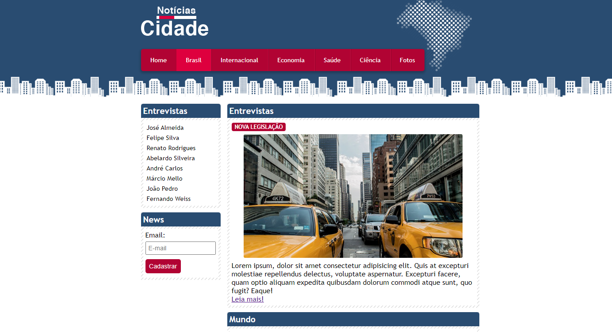
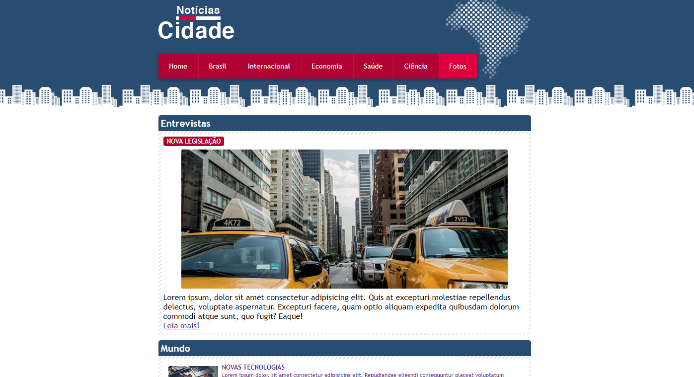

# noticias-cidade-php-css
projeto parar exercitar conceitos sobre css e tags html
este projeto foi baseado em um projeto criado em um curso
onde o foco era html e css, refiz usando php por poder gerar
uma data dinâmica com método date() e também poder ser mais 
simples para escalar com uso de banco de dados e os demais
recursos do PHP, foi atualizado o css com adição de grid e
ajustado alguns detalhes no design do projeto original.

## Home

## Brasil

## Fotos

## Fabio Carneiro
